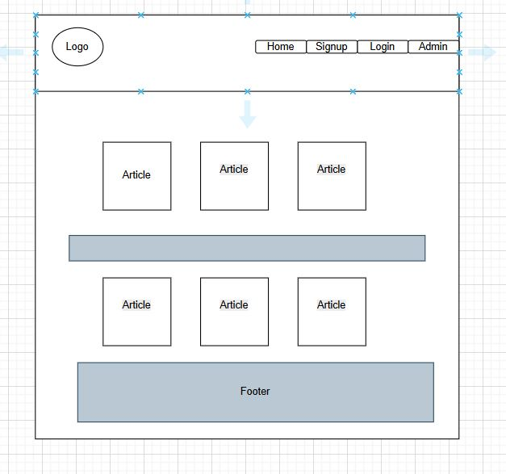

# full_stack_lifecoach_project

# 📐 Clients App – Wireframe & User Flow

This document describes the key pages and navigation flow for the **Clients App** full-stack project.

---

## 🧭 Global Navigation

- **Sign Up** button at the **top-right** in the navbar.
- **Client Login** button also at the **top-right**.
- **Admin** link at the **top-right** (for admin users).

---

## 🗂 Pages & Features

### 1. 🏠 Home Page
- Displays a **grid of article cards** (e.g., informational cards or blog posts):
  - Each card has an **image**, **title**, **short description**, and a **“Read More”** link.
- Top-right navigation includes **Sign Up**, **Client Login**, and **Admin**.
- Visitors can click **Sign Up** to register.

---

### 2. 📝 Sign-Up Page
- Form fields:
  - First Name  
  - Last Name  
  - Email  
  - Phone  
  - Message
- **Submit** → saves client info to the database → shows **Success Page**

---

### 3. ✅ Success Page
- Displays: *“Signup Successful! Thank you for signing up.”*
- **Auto-redirects to the Home Page** after a short delay.
- Includes a **“Go to Home”** button for manual redirection.

---

### 4. 🔑 Client Login Page
- Fields:
  - Email / Username  
  - Password  
- **Login** → redirects to **Client Dashboard**

---

### 5. 👤 Client Dashboard
- Displays client’s profile details (from Sign-Up)
- Contains a tab/section for **Appointments**
- Includes a **Logout** button

---

### 6. 📅 Appointments Page
- Shows a table of appointments:
  | Date | Time | Service | Status |
- Status: *Confirmed / Pending / Cancelled*
- Optional: **Request New Appointment** button

---

### 7. 🔒 Admin Dashboard (Protected)
- Lists all registered clients
- Allows admin to **view / edit / delete** clients
- Allows admin to **manage appointments**

---

## 🔄 Navigation Flow

## AI-Assisted Development Notes

This project was developed with the assistance of ChatGPT (GPT-5-mini), which helped in coding, debugging, and deployment. AI contributions include:

### Code Generation and Optimization
- Generated initial Django app structure, models, forms, and views for `clients`.
- Created boilerplate HTML templates (`client_signup.html`, `index.html`) and integrated `django-widget-tweaks` for better form rendering.
- Assisted in optimizing `settings.py`, including static files with Whitenoise, database setup using `dj-database-url`, and environment variable management with `python-decouple`.

### Deployment Assistance
- Suggested the correct Procfile format and Gunicorn setup for Heroku deployment.
- Provided step-by-step Heroku CLI commands for migrations, superuser creation, static files collection, and web dyno scaling.
- Guided in troubleshooting common Heroku errors, including H14 “No web processes running” and ProgrammingError from missing `auth_user` table.

### Improvements / Manual Fixes
- Renamed `Procfile.txt` to `Procfile` to comply with Heroku.
- Created superuser on Heroku since local superuser doesn’t exist on Heroku database.
- Ran migrations manually on Heroku to initialize tables.
- Configured environment variables (`SECRET_KEY`, `DEBUG`, `ALLOWED_HOSTS`) for production.

### Notes
- AI helped streamline repetitive or error-prone tasks and provided ready-to-use commands and code snippets.
- All code suggestions were reviewed and verified manually before committing.
